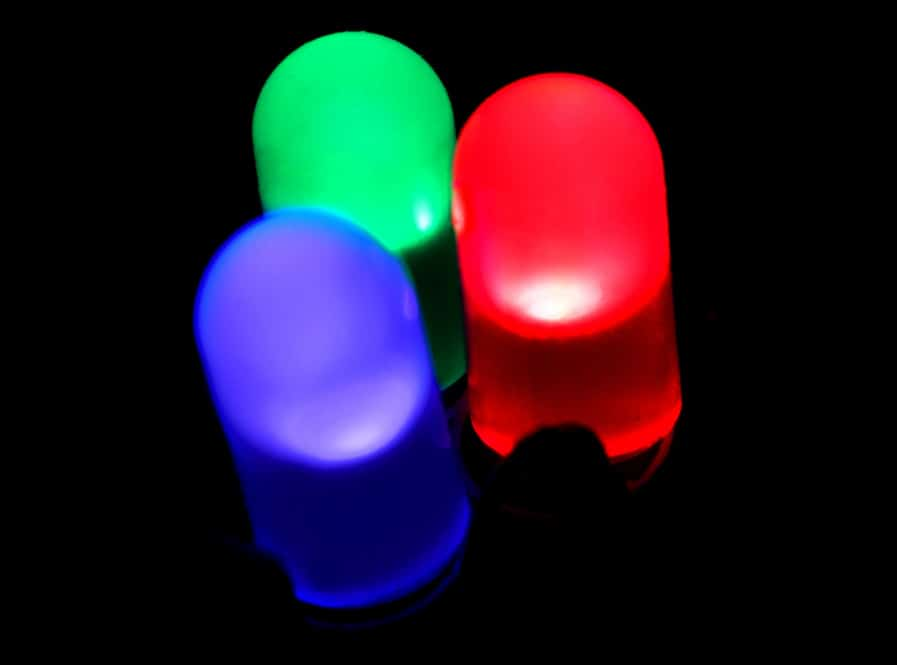
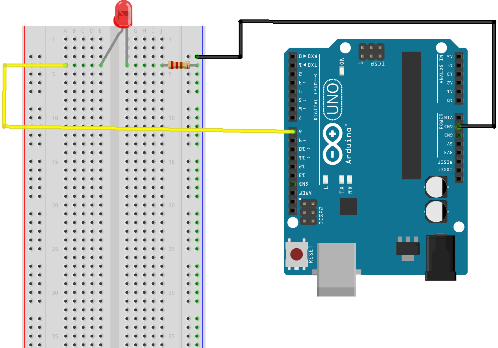

# เริ่มต้น Arduino : LED Arduino
เราเริ่มต้น Arduino ที่สั่งให้ LED กระพริบตามที่เราต้องการ หรือเรียกว่า “Hello World Arduino” ตามธรรมเนียมการเขียนโปรแกรม

หลอดไฟ LED ถูกนำมาใช้ในการให้แสงสว่าง แสดงผลไฟบอกสถานะ มีหลายสี หลายแบบให้เลือก เพราะใช้งานง่าย เพียงแค่จ่ายไฟให้ถูกขั้วก็สามารถทำงานแสดงผลให้เห็นได้แล้ว หรือถ้าต่อผิดขั้วก็ไม่พัง
การสั่งงานให้ไฟ LED เปิดหรือปิดจาก Arduino ก็ทำได้ง่ายมากเช่นกัน เรามาดูกันว่าการทำไฟกระพริบด้วย Arduino จะง่ายแค่ไหน

## 1. โครงสร้างของโปรแกรม Arduino ทุก ๆ โปรแกรมเหมือนกัน ประกอบด้วย 2 ฟังก์ชันหลักคือ

```cpp
void setup(){
 
}
void loop(){

}
```

## 2. คำสั่งที่มีมาให้เราสั่งงาน Arduino ในแลปนี้คือ คำสั่งควบคุมขา Arduino แบบ ดิจิตอล
ดิจิตอล คือข้อมูลของสถานะ 0 และ 1 มีเพียง 2 ค่านี้เท่านั้น
โหมดของขา Arduino ที่เป็นดิจิตอล จะมี 2 โหมด คือ

 โหมด INPUT ทำหน้าที่รับสัญญาณ 0 หรือ 1 จากผู้ใช้หรืออุปกรณ์เซนเซอร์ เพื่อนำมาประมวลผลในโปรแกรมที่เราเขียน
 โหมด OUTPUT  ทำให้ที่แสดลผลสัญญาณ 0 หรือ 1 ไปยังอุปกรณ์ที่เราควบคุม เช่น ถ้าต้องการสั่งให้ LED มีไฟติด ก็ส่งสัญญาณดิจิตอล 1 หรือ 5V หรือถ้าต้องการให้ LED ดับก็ส่งสัยญาณ 0 หรือ 0V ออกไป
  
โดยใช้ฟังชัน
 ฟังก์ชัน pinMode(ขาที่ต้องการควบคุม , โหมด) เช่น 
  - ต้องการควบคุม ขาที่ D1 ของ Arduino ให้เป็นโหมด INPUT  สามารถเขียนโคดได้ pinMode(D1,INPUT); -
  - หรือต้องการควบคุมขาที่ D1 ของ Arduino ให้เป็นโหมด OUTPUT สามารถเขียนโคดได้ pinMode(D1,OUTPUT); -
  
## 3. คำสั่ง หน่วงเวลาในการทำงาน
ถ้าเราต้องการให้โปรแกรมไฟกระพริบเรา สั่งให้เปิดไฟ 1 วินาที และปิดไฟ 1 วินาที เราต้องมีคำสั่งหน่วงเวลาในการแสดงผล ซึ่งใน Arduino มีคำสั่ง delay() เพื่อใช้หน่วงเวลา ใช้งานได้ง่าย ๆ คือ
    delay(มิลลิวินาทีที่ต้องการหน่วง) ใน 1 วินาทีมี 1000 มิลลิวินาที ดังนั้น ถ้าเราต้องการหน่วงเวลา 1 วินาที เราจะเขียนคำสั่งได้ delay(1000);
    เช่นกัน ถ้าเราจะหน่วงเวลา 0.5 วินาที ก็เขียนคำสั่ง delay(500); 
  
## เริ่มต้น Arduino : LED Arduino
เราสามารถนำความรู้ข้างต้นมาเขียนโคดเพื่อสั่งให้ไฟ LED เปิด 1 วินาที และปิด 1 วินาทีสลับกันไป กลายเป็นวงจรไฟกระพริบ เริ่มต้น Arduino ได้ดังนี



```
void setup(){
     pinMode(13,OUTPUT);
}
void loop(){
     digitalWrite(13,HIGH);
     delay(1000);
     digitalWrite(13,LOW);
     delay(1000);
}
```

*** จะเห็นว่าโคดมีตัวอักษรตัวเล็กกับตัวใหญ่ผสมกัน ซึ่งโปรแกรมจะถือว่าเป็นคนละตัวกัน ดังนั้นเราจำเป็นต้องเช็คตัวเล็ก ตัวใหญ่ให้ถูกต้องด้วย

*** ถ้าสังเกตจะเห็นเครื่องหมาย “;” ปิดท้ายประโยค เครื่องหมายนี้สำคัญมาก เพราะเป็นตัวบอกว่าโปรแกรมเราจบประโยคแล้ว ดังนั้นทุกครั้งที่เขียนโปรแกรมจบคำสั่ง ต้องมี ; ปิดท้ายเสมอ
